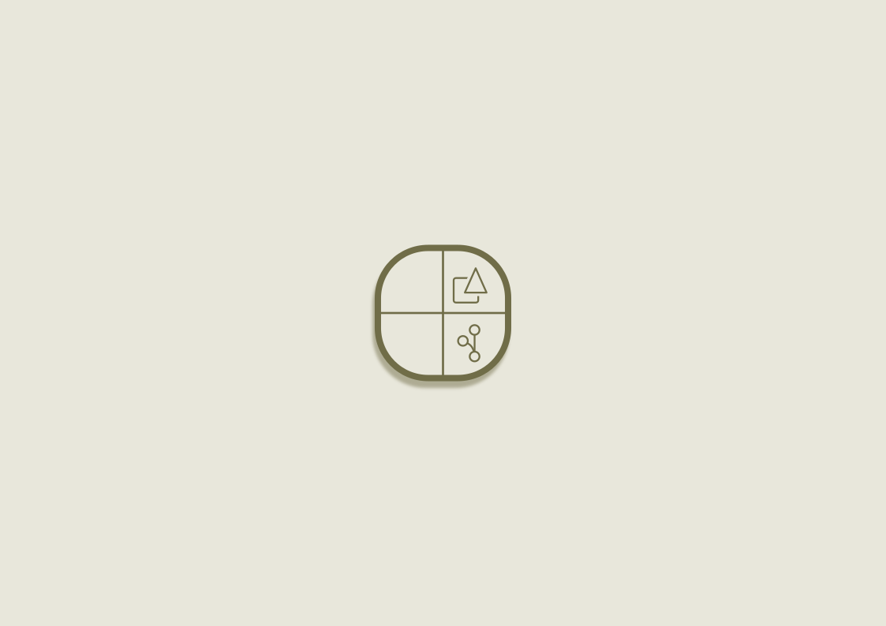
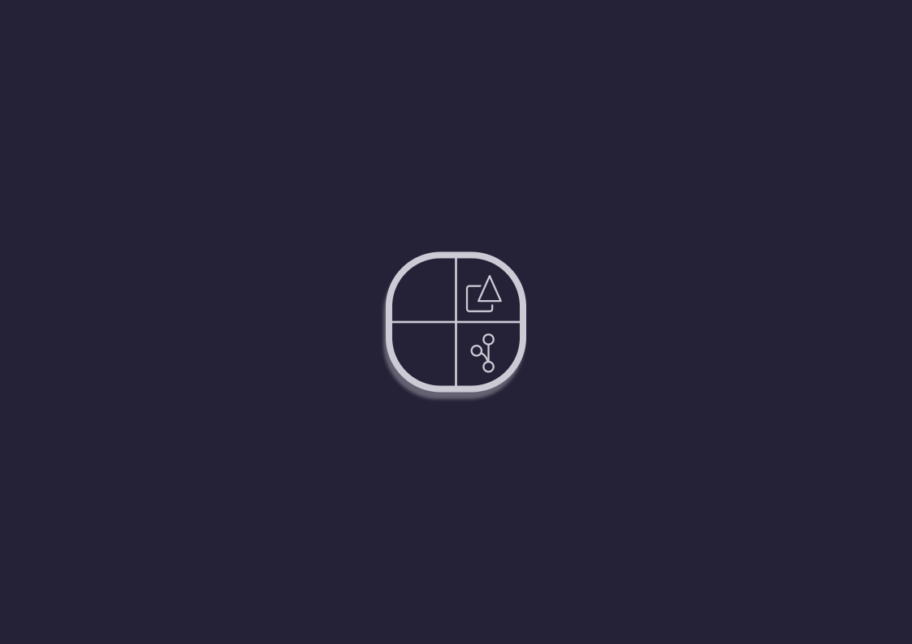
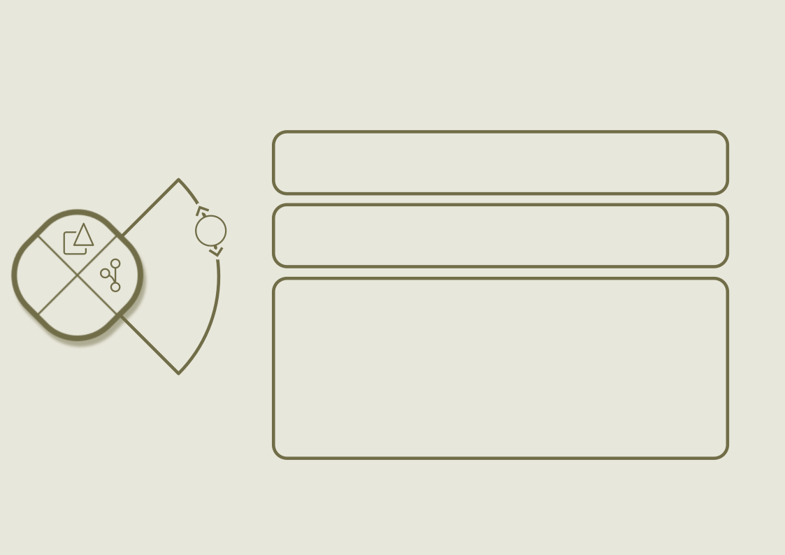
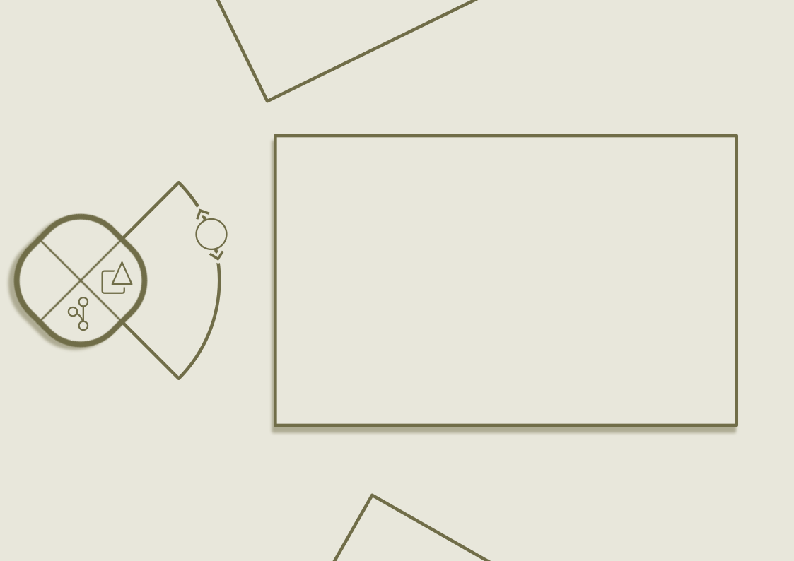

# Personal Site in Progress
## Example designs
### Menu

### Text

The boxes will hold titles which can be expanded into full bits of text, these can
hold details about projects or things about me. You can scroll through this "window"
and the boxes will come into view, the circle with arrows on the side of the menu
shows how far has been scrolled and should be draggable.

### Images

The boxes here are images which you can scroll through and they rotate into full
view. They should be clickable to expand them. Similar to the text design the circle
on the right of the menu can scroll through the images like a timeline.